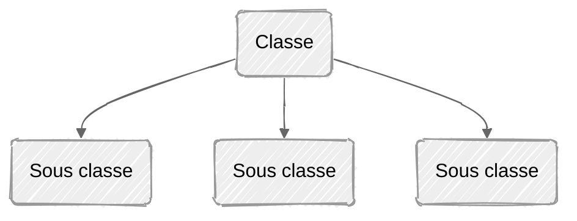
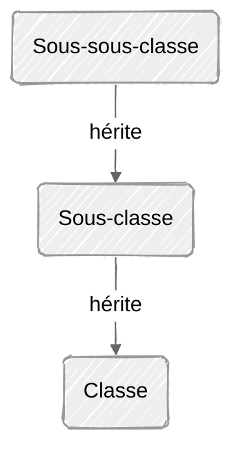

#introprog 

La troisième notion fondamentale de l'OOP est l'héritage.

Par example, une toyota, mazda et ferrari sont toutes des voitures, elles héritent plusieurs types de caractéristiques/fonctions, mais elles sont uniques à chacune (ont toutes un moteur, mais y'en a un qui est clairement plus puissant par eg) 

On a donc un système de classe et de sous classes, où les sous-classes "héritent" de la classe, et ont des spécialisations/sont enrichies.


L'héritage est **transitif**, c'est à dire que si une classe hérite d'une classe qui hérite encore d'une autre, alors la sous classe possède toutes les caractéristiques



```Java
class NomSousClasse extends NomClasse {
	/* Plus de spécifications */
}
```

[[OOP11 - Héritage, protected]]